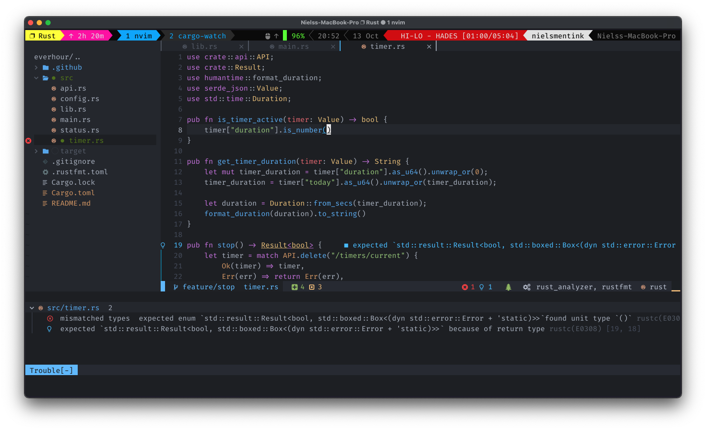

# Dotfiles ⚙️



## Requirements 📦

- Git
- Stow
- 5 minutes of your time

## Installation 🪄

Start by cloning this repository into your `$HOME` directory:

```bash
git clone https://github.com/V1RE/dotfiles.git ~
```

Now you can symlink these dotfiles to your `$HOME` using `stow`.

```bash
cd ~/dotfiles
stow */
```

If you're having problems with the `.git` directory getting symlinked to your
`$HOME` directory, try the following command:

```bash
cd ~/dotfiles
stow -D .git
```

## Graphite + Worktrunk workflow 🌳

This setup keeps [Graphite CLI](https://graphite.com/docs/cli-quick-start) as the
stacking tool and adds [Worktrunk](https://worktrunk.dev/) for separate worktrees
per branch.

- `mise` installs Graphite with `graphite = "latest"`
- `mise` installs Worktrunk with `"cargo:worktrunk" = "latest"` because keys
  containing colons must be quoted in TOML
- `~/.zshrc` initializes Worktrunk shell integration when `wt` is installed

After applying your dotfiles, reload your shell after Worktrunk is installed so
the managed `wt` shell integration is picked up:

```bash
exec "${SHELL:-/bin/zsh}"
```

Recommended flow:

```bash
gtwt my-stack-branch
```

`gtwt` runs `gt create` first, then opens the new Graphite branch in a matching
Worktrunk worktree with `wt switch`.

If you create or already have a branch outside of Graphite, track it first and
then switch into its worktree while checked out on that branch:

```bash
gt track
wt switch "$(git branch --show-current)"
```
