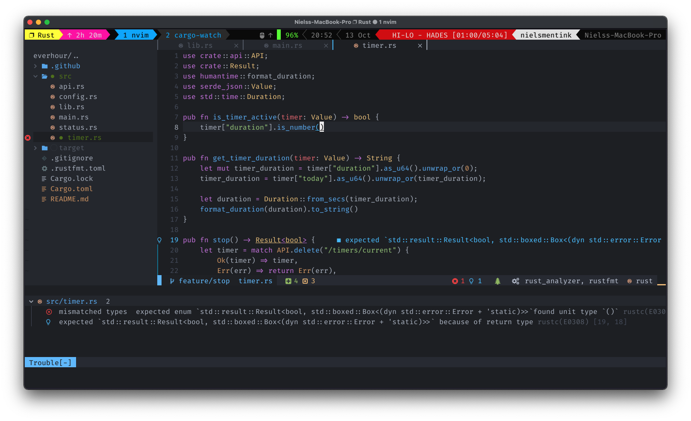

# Dotfiles ⚙️



## Requirements 📦

- Git
- macOS or another chezmoi-supported system

## Installation 🪄

Bootstrap a new machine with chezmoi:

```bash
sh -c "$(curl -fsLS https://get.chezmoi.io)" -- init --apply V1RE/dotfiles
```

Review pending changes later with:

```bash
chezmoi diff
```

Apply them with:

```bash
chezmoi apply
```

## mise profiles

Shared tools live in `dot_config/mise/config.toml`. Platform profiles
(`config.macos.toml` / `config.linux.toml`) load automatically via `auto_env`.
The default role is `desktop` when chezmoi's `hasGUI` is true, otherwise `worker`.
Workers keep additional development tools lazy; Java, EAS, Wrangler and calldiff
are lazy on both roles. Installed lazy tools are not uninstalled.

Override the role per machine in `~/.config/mise/miserc.local.toml`:

```toml
env = ["worker"] # or ["desktop"]
```

Tool installation runs after the profiles are deployed. Existing
`~/.config/mise/config.local.toml` overrides are preserved; on older Linux
installs, its generated tool entries can still override platform defaults.
