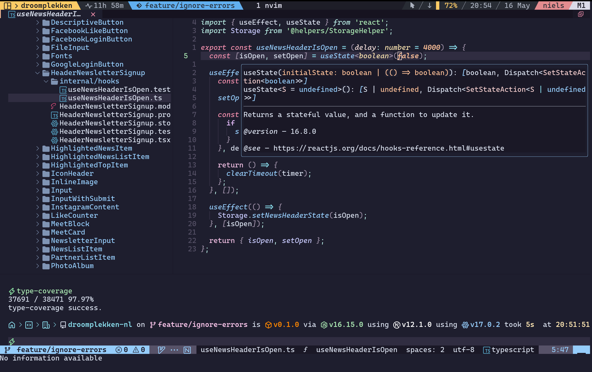

# Dotfiles ⚙️



## Requirements
  - Git
  - Stow
  - 5 minutes of your time

## Installation

Start by cloning this repository into your `$HOME` directory:

```bash
git clone https://github.com/V1RE/dotfiles.git ~
```

Now you can symlink these dotfiles to your `$HOME` using `stow`.

```bash
stow */ -d ~/dotfiles/
```
